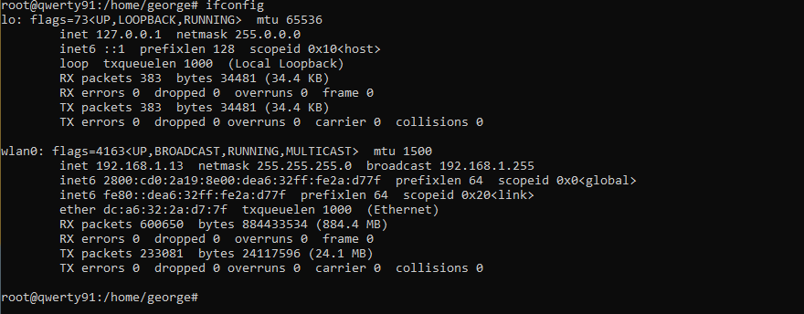
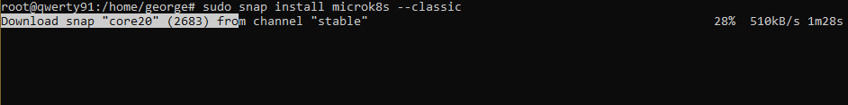
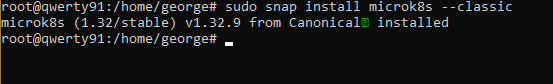
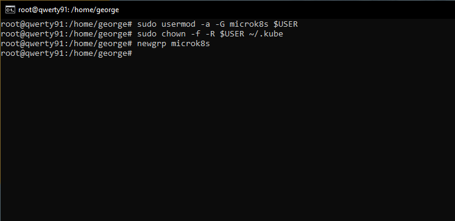
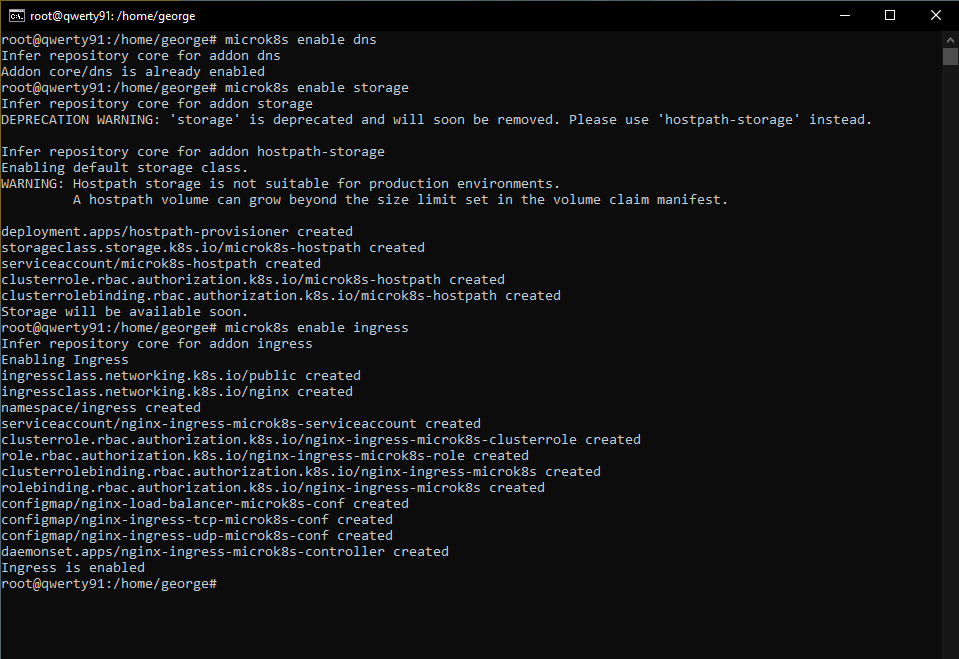
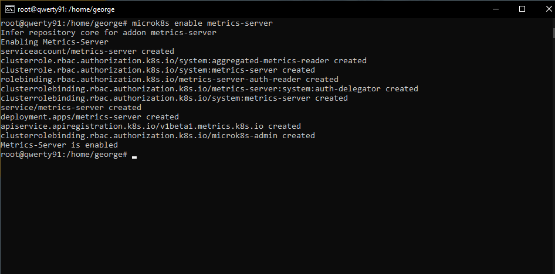
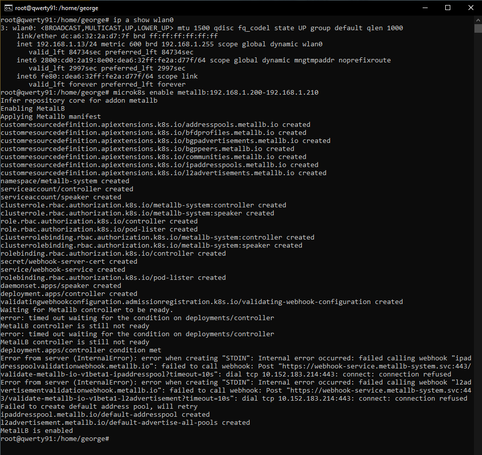
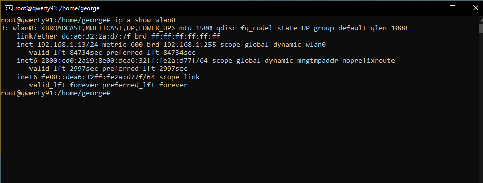

# 01.Setup Ambiente - Preparacion de entorno e instalaciones requeridas

**Preparacion del entorno**

1. Caracteristicas de la maquina u ordenador:

- El entorno con el que se cuenta para el despliegue del proyecto final, se trata de un pequeño ordenador "Raspberry Pi 4" con 2gb de RAM.
- Con el sistema operativo sugerido: Ubuntu Server 24.04.
- El equipo se encuentra conectado a mi red local a traves de su tarjeta wifi con la siguiente direccion IP: 192.168.1.13

2. Instalación `microk8s` orden de pasos seguidos:
- Ejecución de los comando de instalación: `sudo snap install microk8s --classic`
    

    Proceso de instalacion

    

    Instalación completada

- Configuracion de grupos

    
- Configuracion de alias para el comando `microk8s`
    

- Habilitacion de Addons los comandos ejecutados son los siguientes:
    * `microk8s enable dns` Habilitación del DNS de microk8s
    * `microk8s enable storage` Habilitacion del Storage.
    * `microk8s enable ingress` Habilitacion de Ingress
    

    * `microk8s enable metrics-server` Habilitacion de Metraicas
    

    * `microk8s enable metallb:192.168.1.200-192.168.1.210` Habilitacion de direccion IP fuera del rango de la asignacion del DHCP de mi red local.
    

        Para tener mas información acerca de la configuracion del rango de IP que se desea asignar se ejecuto previamente el siguiente comando: `ip a show wlan0` este comando nos permite obtener informacion de la direccion IP que tenemos asignado.
        

1. Apache HTTP Server (httpd)
2. Comandos ejecutados

    ` # docker run -d -p 8081:80 --name mi-apache httpd` (Comando de despliegue - Creación)

    ` # docker logs mi-apache` (Comando de verificacion)

    `# docker rm my-apache` (Comando de limpieza)

3. Explicación breve - Qué hace cada flag del comando `docker run` que usaste:
    - `-d` Ejecuta un contenedor en segundo plano.
    - `-p` Mapea los puertos del host al contenedor. 
    - `--name` Asigna un nombre personalizado a nuestro contenedor.
    - `--rm` Elimina el contenedor automaticamente al detenerse.

4. Evidencia
    - Screenshots 01 (Estado)
    %20-%2001.JPG)

    - Screenshots 02 (Verificación)
    

    - Screenshots 03 (Eliminacion)
    
    
5. Conclusiones
    - *Qué se aprendio*, para esta primera clase se logro aprender acerca de los comandos basico para crear (correr), verificar y eliminar contenedores. Ademas de logramos usar diferentes tags que nos permiten personalizar el "funcionamiento" de nuestros contenedores.

    - *Dificultades*, la dificultad que puedo mesionar es el uso de comandos, al ser una persona que viene del entorno windows. 